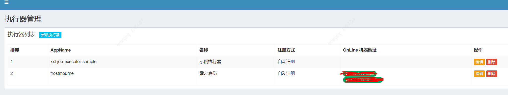

## 介绍

frostmourne(霜之哀伤)是汽车之家经销商技术部监控系统的开源版本，用于帮助开发监控应用日志，现主要用于监控Elasticsearch数据。
关于内部日志系统的设计实现感兴趣的话，请移步文章: <a href="./doc/wiki/design.md" target="_blank">之家经销商技术部基于Elasticsearch的日志系统设计与实现</a> 可以认为frostmoure是监控部分的实现。
如果你现在使用Elastic stack(ELK)建立起了日志系统，却苦恼于没有一个配套日志监控系统，也许它能帮到你。

## 主要功能

* Elasticsearch数据监控
* HTTP数据监控
* UI功能，简单易用
* 监控管理
* 灵活的报警消息模板定制，支持变量
* 多种消息发送方式(email,短信,钉钉(机器人))
* 多数据源管理
* 报警消息附带日志查询短链接，直达报警原因
* 报警消息抑制功能，防止消息轰炸

## 功能截图

* 报警消息


* 新增或编辑监控


* HTTP数据监控

以监控Elasticsearch集群健康状态为例。


检测条件为：集群状态字段status不为green，或者集群节点数量不等于11


* 监控列表


* 数据源管理


* 数据名管理


* elasticsearch数据查询


## 项目初衷

在用ELK建立起日志系统之后，我们发现应用日志监控这块除了ElastAlert之外，没有其他方案。我们初期使用ElastAlert来解决日志监控的问题，
但是随着配置的增加，管理成本，使用成本较高和，配置文件多了之后，稳定性方面也不能让我们满意，所以为了更好的易用性，稳定性，我们决定自己做一套简单的监控系统，
来解决日志监控的问题。如果你面临和我们同样的问题，不妨一试。

## 欢迎使用

由于项目还在重度开发中，有问题或需要帮助请提issue，或者直接QQ联系我: 690392771

## 调试环境要求

* JDK 1.8
* xxl-job 2.1.0
* nodejs
* mysql
* elasticsearch 6.3.2+

## 主要项目结构

* frostmourne-vue

UI项目，使用vue-element-template实现，打包时会打到frostmourne-monitor下

* frostmourne-monitor

监控运行主体项目, 依赖frostmourne-spi和xxl-job。监控调度模块依赖xxl-job[https://github.com/xuxueli/xxl-job] 实现。

* frostmourne-spi

需要根据各自情况适配实现的模块，包括用户相关接口，短链接生成接口, 消息发送(短信发送和钉钉消息发送)接口, 需要自己实现，邮件发送和
钉钉机器人消息发送已经实现好了，其中邮箱配置需要修改为自己的

```
email.smtp.host=${smtp.host}
email.smtp.port=25
email.sender=${sender.email}
email.sender.password=${sender.password}
```

com.autohome.frostmourne.spi.plugin包下的接口，需要你根据自己情况实现。

## 数据库相关

所有表的创建语句在doc/mysql-schema/schema.sql文件中，数据库开发使用druid + mybatis，创建好语句后，自己修改frostmourne-monitor模块的数据库配置

```
druid.datasource.frostmourne.url=jdbc:mysql://[mysql]:3306/frostmourne
druid.datasource.frostmourne.username=[username]
druid.datasource.frostmourne.password=[druid_encrypt_passowrd]
```

druid默认密码加密参考文档: [druid数据库密码加密](https://github.com/alibaba/druid/wiki/%E4%BD%BF%E7%94%A8ConfigFilter)

## 开发调试

本项目依赖xxl-job, 请自己部署xxl-job，并将相关接口权限认证去掉(在action上加注解 @PermissionLimit(limit=false) )，让frostmourne可以访问这些接口。需要了解xxl-job请
查阅官方站点[https://www.xuxueli.com/xxl-job/]. 当前依赖版本为2.1.0，如果存在版本兼容问题，请自行修改适配, 建议单独部署一套新的xxl-job，能避免很多不必要的麻烦。
依赖的xxl-job接口列表如下:

* /jobinfo/add
* /jobinfo/update
* /jobinfo/remove
* /jobinfo/start
* /jobinfo/stop

xxl-job部署好之后，你需要在xxl-job-admin的执行器管理中创建一个名为frostmourne的执行器，注册方式为自动注册，如下图：



然后修改frostmourne-monitor里和xxl-job相关配置。其中xxl.job.executor.id配置为刚在xxl-job中创建的执行器id。

```
### xxl-job admin address list, such as "http://address" or "http://address01,http://address02"
xxl.job.admin.addresses=http://[your_xxljob_address]/xxl-job-admin
### xxl-job executor address
xxl.job.executor.id=[frostmourne executor id]
xxl.job.executor.appname=frostmourne
xxl.job.executor.ip=
xxl.job.executor.port=-1
### xxl-job, access token
xxl.job.accessToken=
### xxl-job log path
xxl.job.executor.logpath=/data/applogs/xxl-job/jobhandler
### xxl-job log retention days
xxl.job.executor.logretentiondays=3
### xxl-job alarm email
xxl.job.alarm.email=[your_email]
```

启动frostmourne-spi项目，active profile设置为default, 测试地址: http://localhost:8180  
启动frostmourne-monitor项目, active profile设置为local, 测试地址: http://localhost:8080   
使用VS Code打开frostmourne-vue目录，进行UI调试。执行如下命令:

```bash
# install dependency
npm install

# 建议不要直接使用 cnpm 安装以来，会有各种诡异的 bug。可以通过如下操作解决 npm 下载速度慢的问题
npm install --registry=https://registry.npm.taobao.org

# develop
npm run dev
```

会自动打开： http://localhost:9528

## 用户管理和登录认证

目前没有做任何密码认证，只要用户名是存在的，任意密码均可以登录, 默认只有admin账号可用。用户信息管理在frostmourne-spi中实现，默认实现方式是一个json配置文件，
需要添加用户的时候，修改这个json文件即可。同样团队管理，部门管理默认也是json配置。  

* frostmourne-spi/src/main/resources/auth/user.json 用户信息配置文件
* frostmourne-spi/src/main/resources/auth/department.json 部门信息配置文件
* frostmourne-spi/src/main/resources/auth/team.json 团队信息配置文件

当然，更好的选择是选择不使用默认的方式，自己实现frostmourne-spi里的相关插件来适配自己内部系统的用户管理。

## 消息模板配置

消息模板使用的语法是freemarker,具体用法参考freemarker官方文档。可用的变量分两部分。一部分是报警规则设置，一部分
是查询出来的数据。不同规则可使用的变量如下表格。

 字段名  | 类型     | 说明  | 适用的判断类型   
-------- |----------| ------- | -----
TIME_WINDOW | int | 查询时间范围窗口大小(单位: 分钟) | 数值 
NUMBER | double | 数值类型值 | 数值
THRESHOLD | double | 判断阈值 | 数值

### HTTP数据内置变量

 字段名  | 类型     | 说明  | 适用的数据源   
-------- |----------| ------- | -----
HTTP_STATUS | int | HTTP状态码 | HTTP 
HTTP_COST | long | 请求耗时 | HTTP

查询的数据可用变量取决于你的数据格式。以我们部门程序日志数值监控为例，可用变量和我们日志格式是一致的。如下表格: 

序号 | 字段名  | 类型     | 说明     | Elasticsearch存储
----|-------- |----------| ------- | -----
1   | LogAt   | DateTime | 日志时间 | iso8601
2   | TraceId | string   | 跟踪Id   | 不分词
3   | Department | string | 部门    | 不分词,统一小写
4   | Team    | string   | 团队  | 不分词,统一小写
5   | Project | string   | 项目名称  | 不分词,统一小写
6   | Host | string   | 域名  | 不分词,统一小写
7   | ServerIP | string   | 服务器IP  | 不分词,统一小写
8   | ContextPath | string   | 虚拟目录  | 不分词,统一小写
9   | UriStem | string   | url主干  | 不分词,统一小写
10  | QueryString | string   | GET参数  | 分词
11  | FormString | string   | POST参数  | 分词
12  | UserAgent | string   | UserAgent  | 分词
13  | Level | string   | 日志级别  | 不分词,统一大写
14  | Class | string   | 记录日志所在类名  | 不分词
15  | Method | string   | 记录日志所在方法名  | 不分词
16  | MethodParams | string   | 抛出自定义异常方法参数  | 分词
17  | Line | int   | 行号  | 整数
18  | Logger | string   | 日志名  | 不分词
19  | IOType | string   | 自定义异常io类型  | 不分词
20  | ExceptionType | string   | 异常类型  | 不分词
21  | ExceptionMessage | string   | 异常信息  | 分词
22  | CustomMessage | string   | 自定义信息  | 分词
23  | StackTrace | string   | 堆栈信息  | 分词
24  | HawkKey  | string | Key  | 不分词 

这样我们一般为程序日志报警定制的消息模板为: 

```
${Project}最近${TIME_WINDOW}分钟内有异常日志${NUMBER}条。最近一条异常信息:
服务器IP: ${ServerIP}
异常类型: ${ExceptionType}
自定义信息: ${CustomMessage}
异常信息: ${ExceptionMessage}
``` 

这里用我们内部使用的例子供大家参考使用，具体模板内容，你需要自己根据数据格式定制。如果你想使用我们的日志格式，请参考
另外一个开源项目: autolog4j[https://github.com/AutohomeCorp/autolog4j]

## 报警发送

现在支持短信,email, 钉钉(机器人)三种发送方式，其中email和钉钉机器人默认可用，短信和钉钉需要自己适配实现。在钉钉群组里
创建好机器人后，把地址复制到钉钉机器人地址输入栏即可。其中钉钉机器人的安全策略选择自定义关键词: 霜之哀伤。

## 报警抑制

监控配置的报警发送配置里有个静默时间配置，是用来实现报警抑制的。主要是用来抑制持续报警发送消息的情况。具有如下特点: 

* 如果这个监控上一次运行触发了报警，这次监控运行没有触发报警，一定发送一条恢复通知。举例: 

```
[霜之哀伤监控系统][id:18]dealer.arch.project.error
@柯长青 
消息类型: [恢复] 请自己检查问题是否解决,上次报警内容如下
[2019-12-09 09:55:35]
frostmourne最近5分钟内有异常日志1条。最近一条异常信息:
服务器IP: 1.1.1.1
异常类型: redis.clients.jedis.exceptions.JedisConnectionException
自定义信息: HashCache error 
异常信息: save(key:xxxx, seconds:xxxx)

详细请看: http://iii94.cn/KYmvPI
```

* 如果这个监控上一次没有触发报警，这次触发了报警，一定发送一条报警通知

```
[霜之哀伤监控系统][id:18]dealer.arch.project.error
@柯长青 
消息类型: [问题] 60分钟内持续报警将不重复发送
[2019-12-09 09:55:35]
frostmourne最近5分钟内有异常日志1条。最近一条异常信息:
服务器IP: 1.1.1.1
异常类型: redis.clients.jedis.exceptions.JedisConnectionException
自定义信息: HashCache error 
异常信息: save(key:xxxx, seconds:xxxx)

详细请看: http://iii94.cn/KYmvPI
```

* 如果这次监控触发报警，并且前面一直在连续触发报警，并且当前报警和连续报警最早那次报警的时间距离小于静默时间，则这次报警被静默处理。
* 如果这次监控触发报警，并且前面一直在连续触发报警，并且当前报警和连续报警最早那次报警的时间距离大于静默时间，则这次报警正常发送。

## 调度配置

调度配置有一个需要特别注意的地方，就是调度间隔和你的数据查询窗口有关系。一般日志系统采集日志多少都会有延迟，少的话几秒，多的话几分钟都
是可以预见的，所以尽量保证两次调度之间查询的日志数据有一定的重叠是很明智的做法，切忌出现数据真空(两次调度之间有数据未被查询窗口覆盖)。
举例：一般的程序错误日志监控配置调度间隔为每2分钟调度一次，查询数据窗口可以配置为3分钟。这样虽然因为1分钟数据重叠可能导致多报(事实上因为报警抑制
的原因，你并不会受到多条报警消息的骚扰)，但是基本可以保证不会漏报。这里只是举一个常见的例子，具体如何配置，你需要根据自己的实际情况。

## 部署

UI项目frostmourne-vue会自动把资源打到frostmourne-monitor的resources/dist下，所以你只需要独立部署frostmourne-spi和frostmourne-monitor，
他们都是无状态的服务，分配好域名做负载均衡，其中frostmourne-monitor依赖frostomourne-spi。在frostmourne-monitor配置文件中配置frostomourne-spi地址:

```
frostmourne.spi.service-addr=http://${frostmourne-spi-address}/
frostmourne.monitor.address=http://${frostmourne-monitor-address}
```

其中frostmourne.monitor.address配置用于生成日志查询地址。最后以短链接的形式放在报警消息里。**注意：直接使用ip是无法生成短链接的**

## 监控测试

一般在创建监控或者刚创建完监控的时候，你会想测试一下监控的执行。在监控保存页面有测试功能，你可以尝试不同的查询
语句来验证你的想法。

另外在监控列表页面，你可以点击运行按钮让监控立即运行而不必等待调度来验证你的想法。

## 监控另存

在创建了很多监控之后，你会发现同一类型的大部分监控是非常相似的，这时候你就会想要监控另存功能。你可以在监控列表的已有监控
中找一个和你想要创建的监控相似的监控，点编辑进入监控编辑页面后，直接另存，就会生成一个一模一样的新监控，然后你就可以安全的
修改这个新监控了。之所以建议直接另存是因为你会非常容易忘记你是想另存一个监控，而去点了保存按钮。就会把现有监控覆盖掉。

## 短链接服务

为了方便使用者快速查看产生报警的日志，报警消息最后会有一个日志查询地址的短链接，打开即可看到产生报警的日志。默认短链接实现使用
的是四五短网址免费版，网址: <a href="http://www.45dwz.cn/" target="_blank">45短网址</a>, 默认申请的token限制很大，
调用次数有限制，你可以去45短网址申请自己token，或者你可以自己选择换别的短网址服务都行，只需要自己实现简单适配即可。

如果你自己申请了token，请修改配置文件 frostmourne-spi/src/main/resources/application.properties 如下配置值：

```
dwz45.token=t8HGzRNv9TmvqUFICNoW3SaYNA1C9OAC
```

## 后续规划

目前还有很多feature需要持续开发，目前已知的规划有: 

* 日志查询结果分享;日志导出csv
* 添加dashboard页内容
* 增加数据mock，部署一个公网可访问的全静态demo站点，方便别人进行功能预览试用
* 发布1.0-RELEASE
* Elasticsearch数据监控增加多种聚合类型(如: avg, unique_count, percentiles)数值监控
* 增加influxdb数据监控(数据同比，环比监控)
* 增加prometheus支持
* 加强登录安全(集成ldap, CAS单点登录)
* 增加Dockerfile
* 增加单元测试
* 国际化
* 移除xxl-job依赖，内置实现监控调度，减小部署难度(待讨论)

## 主要技术栈

* springboot 2.x
* element ui
* vue-admin-template
* mybatis
* freemarker
* elasticsearch
* jjwt

## Contribution

[@menong-chen](https://github.com/menong-chen)

## 致谢
- [springboot](https://github.com/spring-projects/spring-boot)
- [vue](https://cn.vuejs.org/index.html)
- [vue-admin-template](https://github.com/PanJiaChen/vue-admin-template)
- [xxl-job](https://github.com/xuxueli/xxl-job)
- [element ui](https://element.eleme.cn/#/zh-CN)
- [45短网址](https://45dwz.cn/)
- [jjwt](https://github.com/jwtk/jjwt)
- [vue-json-pretty](https://github.com/leezng/vue-json-pretty)

## License

The project is licensed under the [MIT](LICENSE).
