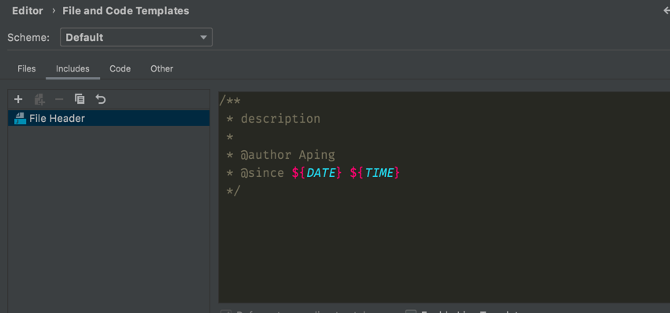

## 代码规范说明


### 一、设置文件头注释
IntelliJ IDEA 在 Editor -> File and Code Templates 里设置文件头模版：

```
/**
 * description
 *
 * @author your name
 * @since ${DATE} ${TIME}
 */
```



当修改某个类时，请在@author后面追加你的大名，名字以逗号+空格隔开

### 二、设置code-format

1. IntelliJ IDEA 在 Plugin 市场搜索安装Eclipse Code Formatter 插件 
2. 安装成功后在 Other Settings -> Adapter for Eclipse Code Formatter 中启用
3. 在 Eclipse workspace/project folder on config file 里指定 [code-formatter.xml](./file/code-formatter.xml)

    
