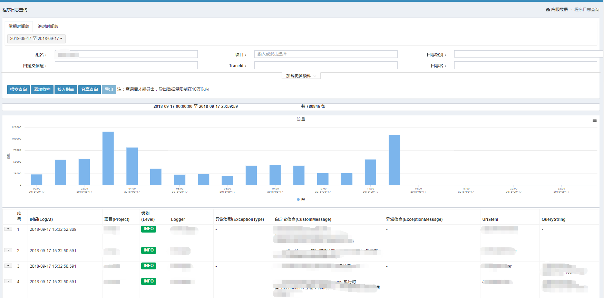
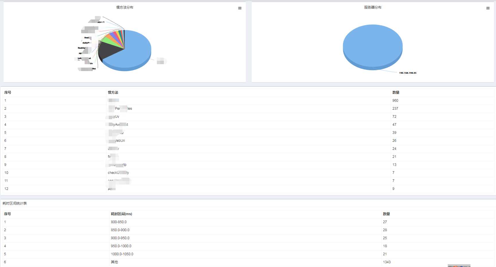
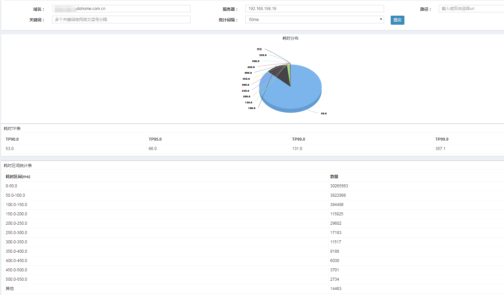
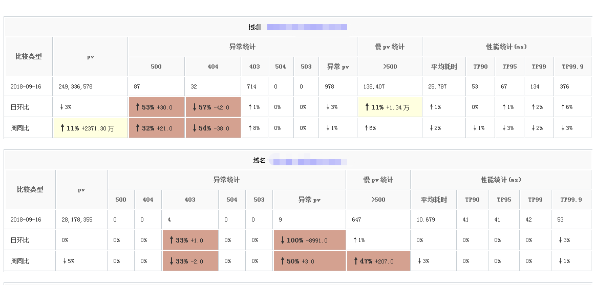
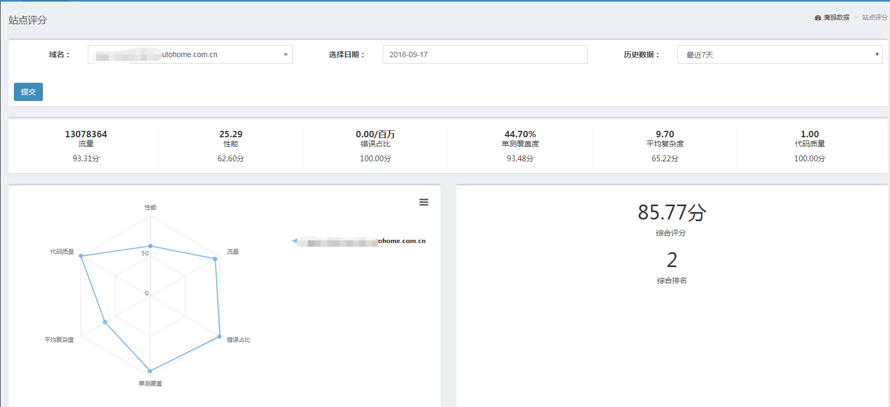
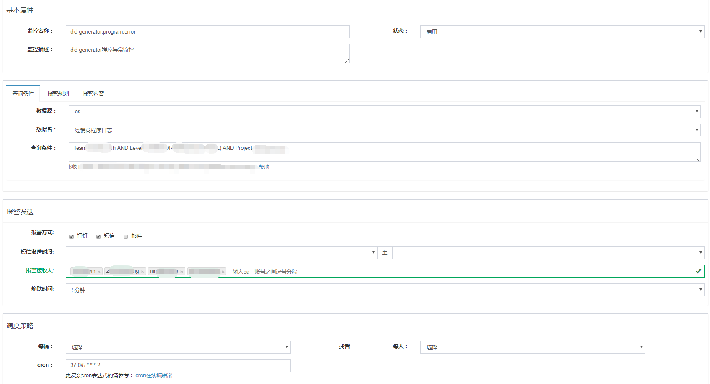
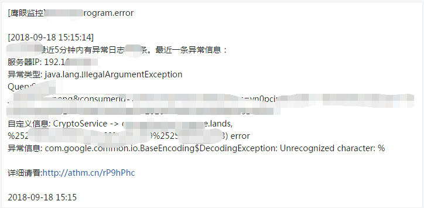
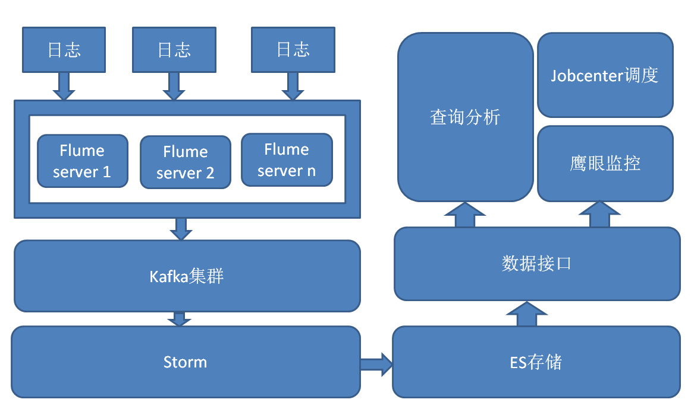

# 之家经销商技术部日志系统设计实现

## 1. 背景
____________________________________

之家经销商业务迅猛发展，技术团队日益壮大，系统的数量和复杂度快速上升，从3年前的20人到现在170人的技术团队。
在对业务提供支持的过程中，我们自己面临了不少的问题，主要痛点如下：

+ 痛点1：发现问题的时间点严重滞后于端用户

以前问题反馈的路径是：端用户反馈给顾问，顾问找产品确认，产品找开发和测试。这条反馈路径相当长并且低效。
一般来说，当顾问收到用户反馈的时候，造成的影响面已经不小了，这中间还有信息流转，沟通不畅等问题，根本无法
做到先于用户发现问题。

+ 痛点2：开发排查问题效率低下

大量的文本和不合理的日志记录，不仅没有带来效率提升，反而是一个阻碍，从几百兆的文本日志里查找关键错误信息
对任何人都是一个很大的挑战，更别说效率了。所以基本是靠回忆上线改动，然后猜测验证，中间还有反复的过程，对
开发来说，也是相当痛苦。

+ 痛点3: 开发对自己系统运行状况毫无把握

在以前，你如果问开发同事，你们接口的性能咋样，平均耗时，tp99是多少，一天有多少个500错误，耗时大于500ms
的请求一天有多少个，开发同事只能用绝望的眼神告诉你：不知道。看到这里，开发的同学都可以自问一下，能否回答出
这些问题。  

没有系统指标统计和监控，往往让开发感觉平静的表面下暗藏各种问题，不知道什么时候爆发。问题反馈到开发的时候，
开发毫无准备，毫无安全感，不说疲于奔命，离从容应对还差十万八千里吧。

+ 痛点4: 没有日志监控的微服务是半条腿走路

注意不是一条腿是半条腿。在我们团队开始微服务选型的时候就已经意识到，没有系统全面的日志和监控，微服务带
来的问题不会比收益小。

相信这些问题，每个开发团队多少都会有共鸣。

## 2. 解决方案
_____________________________________

解决这些痛点的办法，一套好用的日志系统是一个很自然的解决方案。之前，日志的利用率简直低到可怕，线上产生
大量的文本日志，根本无人问津，要想从这些日志里挖掘关键的信息，你需要会很多高级技能和一些黑科技工具，让很多
开发同事望而生畏。所以首先要挖掘日志这座金矿，提高日志利用效率。日志系统能解决排查问题低效的问题，
但是要解决其他几个痛点，还需要配套的日志监控系统。  

所以我们最后的目标是：一套集日志收集，查询分析，监控报警于一体的日志系统。  

## 3. 选型
__________________________________

易用性,灵活性,扩展性的权衡  

日志系统作为一个产品，它的产品功能设计和体验相比技术更加重要，而且技术同时也是产品，这对我们做技术的人来说
才是更大的挑战，也是更大的乐趣所在。  

问题1：kibana已经提供了强大灵活的日志分析功能，我们是否需要再做一个自己的日志产品。  

我们的答案是需要的。灵活强大是kinaba的优点，同时也是弱点，因为对于很多长期业务开发的同事来说，kibana，elasticsearch,lucene查
询语法的学习成本并不算低，最主要的是平时大家使用的查询都是相对很简单的，分析模式也相对固定，一个web页面的form表单，几个简单操
作就能完成90%以上的需求，易用性高于kibana很多，这点大家不要误解为对kibana的批判，并不是kibana不好，只是在我们这种场景下，我们
更看重易用性，没有绝对好与不好，只有是不是适合。  

问题2: 已经有了开源的或收费的日志系统，我们是否需要做一个自己的日志产品。

在已经有了开源的日志方案(代表为点评的CAT系统)，也有以日志易为代表的收费Saas日志服务的情况下，我们选择自己开发一套
日志系统的主要原因是功能的可扩展性考虑。在刚开始日志需求较为初级的时候，现有的方案基本都能满足需求，但是作为一个
内部日志系统，我们预见个性化的定制需求会层出不穷，所以轻量和功能的可扩展性我们尤其重视，在这样的权衡场景里，我们
自己开发的日志系统在轻量，可控性，可扩展性方面，是现成的方案是无法比拟的。事实也证明，我们的考虑是对的，后面很多
很重要的定制化的需求里，如果是基于现有解决方案基本是无法实现的。  
另外关于日志Saas服务还有一个很难克服的困难就是日志数据本身是很重要，保密性较高的数据，一般来说，很难让公司放心
的存入别人的数据库。

所以在选型里过重和灵活性通常是被舍弃的部分，我们更偏重易用性和扩展性。这一准则也贯穿了我们
自己在做日志系统的时候整个过程。
  
## 4. 成果
_______________________________________

目前日平均收集访问日志40亿，程序日志10+亿，程序慢日志300W，日均UV
110，是部门整个开发团队(包括测试)大半的人数。监控数量达到1000+，日均运行38万次检测。  
从收到的反馈和效果来看，基本解决了前面提到的痛点。  

目前监控系统已经部分开源，详细请查看github地址: <a href="https://github.com/AutohomeCorp/frostmourne" target="_blank">frostmourne(霜之哀伤)</a>

## 5. 日志分类
_______________________________________

我们将日志分为如下几类:

+ 程序日志

程序日志可以说是最为重要的日志，使用log4j, nlog等日志框架记录程序里一些重要事件(异常的捕获，业务逻辑的异常等)的发生。
程序日志都是开发人员经过思考人工埋的记录，在所有日志类型里含金量最高，这些记录在监控，排查问题中的作用举足轻重。

+ web访问日志 

http服务调用记录。常见的如：nginx日志，iis日志，tomcat访问日志等。从访问日志里，我们可以得到服务流量，总体性能，错误
占比等这些非常重要的HTTP服务指标。在排查问题中同样占有重要的位置。

+ 程序慢日志 

程序慢日志这个概念，先解释一下，类比数据库的sql慢日志，程序些慢日志就是记下那些执行耗时较长的方法和上下文信息，
便于排查一些程序的性能问题。

+ 调用追踪日志

APM系统大多基于调用追踪日志来实现，比较知名的如：zipkin, skywalking, pinpoint等，这些APM系统的实现原型基本都是来自
google发表的Dapper论文。我们部门目前使用的是skywalking。

我们认为调用追踪日志只有在服务数量和复杂程度到相当大的体量的时候，才显得比较重要，另外需要整个公司用一套解决方案，
形成较完整的调用链条才能发挥最大作用，而且有前面提到的比较成熟的单独开源解决方案，所以在自研里它的优先级最低。

## 6. 日志系统功能介绍
___________________________________

技术价值最终都是需要通过产品来实现。最后我们的日志系统具备的主要功能(并非所有)如下：  

+ 程序日志, 慢日志, web访问日志明细查询；  

用于查询各种日志的明细数据。可以根据所有字段进行过滤，非常方便强大。  

  

+ 慢方法分析；  

可以针对项目分析，哪些方法执行超过阈值次数最多，方法耗时各区间数量的分布。  

  

+ http服务性能分析；  

用于分析特定域名或url的性能。包括tp统计，耗时区间分布统计。  

  

+ http服务异常流量分析； 

用于分析特定域名下各url状态码异常的数量。  

+ http服务慢url分析； 

用于分析某域名下哪些url耗时较长。

+ 按天聚合的域名数据统计查询，形成日常报警邮件发送给关切方。

包括每个域名每天的pv, 500, 404, 503, 504, 平均耗时, TP90, TP95, TP99, TP99.9数据。日报邮件如下图:  

  

邮件将这些指标和昨天和上周指标做对比，波动幅度比较大的用红色标记，提醒接收人注意有可能存在变坏的风险。目前
通过邮件提醒已经帮助同事提前发现若干次慢性问题。

+ 站点评分

结合静态代码指标(单测覆盖率，代码复杂度，代码质量分)和动态运行指标(流量,性能,可用性)综合评价所有站点，
做一个排名，利于内部互相比较，了解自己站点各方面和别人比处于一个什么样的位置。

+ 监控报警

作为日志系统，日志的查询和分析只能达到50%的完成度，另外的一半就是监控报警。  
开源的日志监控相关产品基本都是针对指标类时序数据的主机监控，比如：zabbix，open-falcon, Prometheus等。针对业务文档类数据的日志监控的项目基本没有，
只有ElasAlert还算可用，在使用了一段时间之后，面临很多棘手的问题：死板的调度策略(只能统一每隔x分钟，所有监控调度一次，经常不知道堵在哪个监控)，
报警内容无法做灵活定制，配置文件管理困难，后面我们的配置文件数量达到200左右，一个配置文件配置不当，进程挂掉或阻塞，最后效果可以说很不理想。
在经历这些过程后，我们决定自研一套监控系统。耗时1个人月上线运行。  

主要功能有程序日志监控，访问日志监控，慢日志监控，http调用监控，metric监控。目前运行监控数量近800个，基本线上有问题，开发同事分钟级别就能收到报警。
无论是从使用者的反馈和运行情况来看，效果还是很理想的。下面是一张我们监控配置的页面截图：  

下面是我们监控产生的钉钉报警内容的截图:  

+ 权限控制

目前实现了部门之间日志隔离。

在监控建设完成后，我们的日志产品基础核心功能基本完备，除了自己的功能设计之外，有很多功能是来自使用系统的同事的反馈，
感谢同事们宝贵的意见。  

目前监控系统已经部分开源，详细请查看github地址: <a href="https://github.com/AutohomeCorp/frostmourne" target="_blank">frostmourne(霜之哀伤)</a>

## 7. 系统整体结构图
___________________________________

 

结构图左右分开看，左半图是日志采集过程，右半图是日志存储和使用的过程。左半图从上往下看，右半图从下往上看。
可以看到Elasticsearch和kafka这对日志的黄金搭档。

## 8. 日志格式设计
___________________________________

日志系统第一个要设计的点就是要统一日志格式，包括程序日志，web访问日志。因为日志格式如果不统一，后面采集，
存储和数据接口开发的复杂度成倍数增加。尤其在多语言环境的团队，日志格式不统一的太常见了。所以在开始做日志系统之初，
我们就设计了程序日志的格式，包含了23个字段，可以说是非常全了。web访问日志因为最开始收集的是iis日志，
所以就沿用了iis日志的标准。日志格式统一的实现依赖现有日志类库良好的扩展性，我们在log4j, nlog基础之上很容易做到了扩展，
实现了日志格式的统一。  

这些日志扩展已经开源，详细请看github地址: <a href="https://github.com/AutohomeCorp/autolog4j" target="_blank">autolog4j</a>

## 9. 日志端采集原理
___________________________________

目前支持两种日志采集方式：

+ host-agent

在主机上安装agent程序，独立运行采集应用写的文本日志发送至服务器监听端口。我们选用的是nxlog，nxlog在资源占用低，
稳定性，日志发送速度这些方面都表现得很好。目前承担了全部程序日志，全部iis日志和大量nginx日志的发送任务，一直比较稳定。
有一个小限制就是一条日志的长度，社区版本有限制，会导致过长的程序日志无法发送，但是这种日志很少。  

+ process-agent

随应用部署到服务器上，在应用进程内运行采集日志直接走网络发送至服务端。我们直接采用大数据部门提供的log4j-appender扩展
组件集成到java应用里。目前这种方式也很稳定，承担了java应用访问日志的绝大部分采集，中间只出过一个问题，

关于两种方式的优缺点，做一个对比矩阵：

| 采集方式 | 优点 | 缺点 
| ------- | ---- | ----
| host-agent   | 可靠性较高, 无代码入侵 | 每个服务器都需要单独安装和配置，成本相对较高
| process-agent | 接入基本没成本，接入方便 | 有入侵，可靠性不如host-agent方式

### 9.1 程序日志采集

程序日志现成大量文本日志，自然而然的选择了host-agent的方式。当时主要的问题还是日志格式不统一的问题。
为了保证日志质量和降低接入成本，我们可以通过扩展现有的开源日志类库定制特定的组件，具体来讲，
我们针对log4j1, log4j2扩展了自己的layout, 针对nlog-2.0扩展了LayoutExtension;  

程序日志记录文本然后走网络发送还有一个额外的好处是起到冗余备份的作用，因为日志直接网络发送的话，谁也无法保证100%的可靠，
记录了文本就可以防止一些关键日志发送失败无法查找的问题。虽然这种情况很少。

目前程序日志平均每天采集数量达1.9亿，磁盘占用约140G。

### 9.2 访问日志采集

和程序日志相比，访问日志情况要复杂得多，因为webserver种类不一，一般至少有iis,tomcat,nginx三种，而且格式
无法统一。  

iis和nginx日志我们采用host-agent方式，因为这两种都已经有大量可用的文本日志，只需要处理格式不统一的问题，
要想iis和nginx打出一样格式的日志是不现实的，但是我们可以分别为iis日志和nginx日志制定统一的标准，然后在
这标准之上处理为统一个访问日志，这样成本就不会很高。  

公司java应用几乎都是tomcat应用，但是tomcat开启访问日志对应用性能影响很大，所以一般我们都会选择关闭tomcat日志，
这样一来tomcat记文本这条路是不通了，这也是为什么把它和iis，nginx区分的原因。  
我们的解决办法是开发一个springmvc的filter拦截请求，记下日志，然后通过process-agent走网络发送出去。  

目前访问日志平均每天采集数量达14亿，磁盘占用约420G

### 9.3 程序慢日志采集

程序慢日志是通过AOP的around拦截方式，记下目标方法的执行耗时，当耗时大于设定的阈值时，打一条慢日志。发送方式采用
process-agent，考虑到程序慢日志本来就是一种采样的采集，对可靠性要求并没有那么严格，而且接入方便是我们非常看重的一个点，
方便接入才方便推广给大家使用。nxlog配置虽然有样本模板，也并不复杂，但是对于没接触过的同事来说还是有些犯怵导致一些理解上的障碍。

## 10. 服务端采集原理

### 10.1 日志接收
___________________________________

在日志系统无到有的过程中，日志的增长速度是很快的，接收端就会面临水平扩展对客户端
无感知的问题，这里通过对客户端暴露域名，使用lvs做负载均衡，后面扩展机器只需要增加域名解析
的方式实现。

logstash我们也有在用，logstash的优点是自带数据处理管道，
对一些较为简单数据转换清洗来说很方便，而flume如果要做清洗，就需要写java代码，打包上传然后修改flume配置文件，
相对麻烦许多，但是和flume相比来说，logstash对资源的占用要高很多，在我们的场景只需要简单的接收和写入kafka，
并不需要清洗和转换，所以这块选择了flume。

### 10.2 kafka的作用
___________________________________

在日志发送速度很大的情况下，日志存储数据库Elasticsearch就会随时面临高写入的挑战，所以中间引入了高吞吐，适合
大数据场景的kafka队列做中间缓冲。另外当elasticsearch集群不可用时，可以保证日志收集不受影响，提高系统整
体的可用性也是很重要的一方面。总的来说，引入kafka可以保证日志接收端不会成为一个瓶颈，进而保证对各个发送端不造成坏影响。

### 10.3 日志消费和写入
___________________________________

日志的消费和写入使用高性能实时计算框架-Storm来做，事实上spark和storm都能很好的完成这部分工作；
我们选择storm的原因很简单。公司刚好提供了Storm集群的资源和专门的运维团队，我们在使用storm也有一定的积累。  
在写计算任务的时候，面临的一个问题是，一次处理一条日志然后写入Elasticsearch这种简单
处理方式吞吐量不够，解决思路是写操作合并，每接收100条日志写入一次Elasticsearch吞吐大大提高。

另外一个问题是elasticsearch索引默认的refresh时间间隔是1s，在大量日志场景，1s刷新会造成很大
的资源浪费，会有很多小段生成，对集群压力很大，所以这里调整了日志索引的刷新时间为5s，相对会好很多。

### 10.4 日志存储优化
__________________________________

在收集大量日志后，一般来说磁盘空间会成为一个瓶颈，虽然elasticsearch默认是有数据压缩的，但是是做了
压缩比率和查询性能的平衡，压缩率并不是最高，但是日志场景，查询性能通常并不会成为困扰的问题，所以很适合
把数据压缩做到最高，把索引的codec配置为best_compression，经过对比能省出大约20%的空间。  

elasticsearch集群能管理的数据并不是无限的，主要受两方面的制约，磁盘空间和elasticsearch集群管理的分片数量是有上限的，
超过这个限制，集群就会出现很不稳定的问题。好在日志数据作为一种时序数据，它的主要价值都在最近时间段的数据里，
历史数据价值就小很多，所以非常适合rotate close clear。通常保留最近一个月甚至可以更少的数据就足够了。

另外就是日志存储字段类型的考虑，主要是字段是否需要分词，是否需要全文检索。每个字段都要考量真实应用情况来决定。
不需要分词的用keyword类型；关闭norm，日志场景通常不需要文档得分计算，更多是按时间排序即可。  

日志到达一定量还需要考虑分索引存储的问题，单个索引存储的文档也不是无限的，分索引有两种方法：

1. 由按天存储划分为更小的按小时存储。
2. 按部门划分索引，不同部门日志存放在不同索引里。

我们选择第二种方法，原因是第一种方法在提供查询服务的时候，能查询的时间范围肯定要小很多，因为查询时间范围越大，需要
查询的分片数目越大，举个最常用的访问日志查询案例：查询域名www.autohome.com.cn昨天的访问日志，方法一要查询
24 \* shard_count数量的分片, 而域名所属的部门是确定，我们就只需要查询对应部门的索引只需要查： 1 \* shard_count数量的分片，当然
查询效率要高很多。

## 11. 日志应用
____________________________________

系统结构图右半部分可以看到，我们在elasticsearch之上做了数据接口，供日志后台和监控调用，还有一个独立的监控
任务调度中心负责监控的调度。关于这部分和日志相关技术本身干系并不大，所以不在这里做更多的说明。

关于我们的日志系统主要的点就是这些，作为一个整体的系统还是有很多的细节无法一一说明，如果针对某个点
想了解更多细节欢迎联系我们团队。  

## 12. 经验总结
____________________________________

+ 快速原型，迭代  

在需求很迫切的时候，大家需要的并不是大而全的系统，很可能是一些很基础的功能，识别这类需求快速上线是
非常重要的。所以我们最先做的是统一程序日志格式，收集和查询页面。这样大家开始熟悉我们的产品并快速反馈。
原型有了之后后面有许多的需求要做，这时候需要识别需求的轻重缓急，快速迭代出那些性价比高的需求，一些耗时
较长，使用率低的优先级降低。

+ 重视用户需求  

用户提出的需求虽然往往很粗糙，太细小或模糊不清，但是认真的思考用户诉求本质是什么，结合产品往往会产生
很酷的点子。  
举个例子，在有了很多的日志数据之后，有小伙伴提出利用我们的日志数据提供一个业务系统质量评估，我们觉得
这个想法很好，进行了进一步分析，得到各个业务的综合排名，让大家看到自身系统和兄弟系统之间存在哪些差距，
对差距做出改进，进而形成良性循环。  
日志系统很多功能都来自开发小伙伴的反馈。

+ 做够用的设计  

无论是产品设计和还是技术设计，它的范围很多时候非常宽泛，设计不足不利于进化，设计过度带来的复杂度同样
不利于迭代，甚至过犹不及。我们的经验是小团队内部充分讨论，确定进化的方向，在保证可以进化的前提下，
能最快上线的设计我们认为就是刚刚好的设计。这样的设计往往也比较简洁易用。

最后特别感谢用户产品中心的同事，在之前访问日志的接收和存储都是由用户产品中心的同事维护，日志收集结构的原型
也是从他们那里来的，后面考虑到要持续投入更多的时间，由我们自己接手做更合适，才转移到经销商部门。