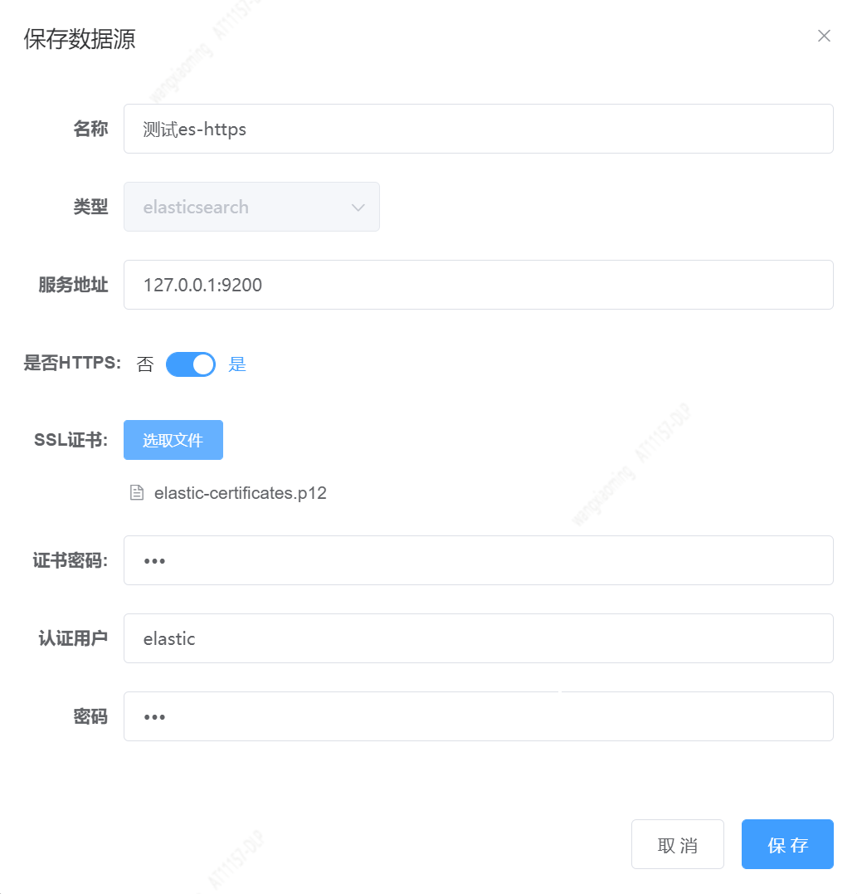
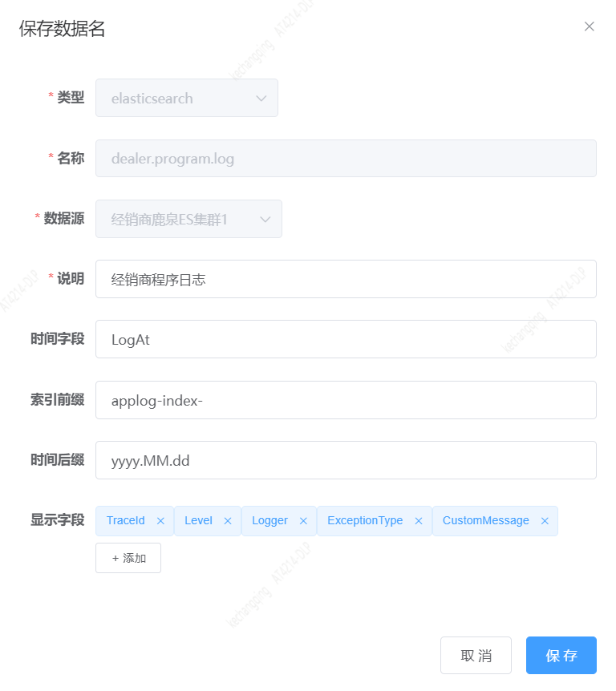
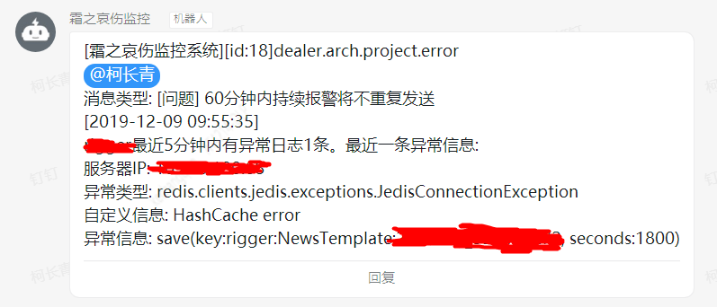

## Elasticsearch数据监控指南

下面以程序日志错误监控为例子，说明创建一个elasticsearch监控的过程

### 1. 添加elasticsearch数据源

打开页面：数据管理->数据源，点击新增按钮，弹出窗口，填写字段并保存。



其中服务地址填写Elasticsearch服务的地址，如果有多个用英文逗号分隔。
>注意服务地址端口不能缺省，就算是80端口也需要加上

### 2. 添加elasticsearch数据名

打开页面：数据管理->数据名，点击新增按钮，弹出窗口，填写字段并保存。



数据名在elasticsearch场景可以理解为索引模式，之所以不直接用索引，是因为项目计划不只支持elasticsearch，还会
支持influxdb等其它数据源类型。索引后缀如果不是标准的时间模式，可以用*号。

### 3. 验证查询

添加完数据名，打开数据查询页面。下拉选择刚才保存的数据名，点击查询。如果查出来数据和你的索引数据对上了，说明数据信息都
填写正确了。


query string查询语句语法不清楚的，可以参考文档: <a href="./query-string.md" target="_blank">query string简易教程</a>，查询页面主要
小特性列表

* 查询语句输入框会有历史查询记忆功能，用起来很方便。
* 数据表格第一列是一个展开箭头，可以展开数据查看完整的日志内容。
* 数据可以下载，文件格式为csv，限制在10w条以内
* 点击分享按钮，查询还可以以短链接的形式分享给其他人
* 如果你想用当前查询语句创建监控，直接点击添加监控按钮，就会直接带到监控创建页面

这些小功能可以说相当贴心了。

### 4. 添加监控

打开页面：监控管理->监控编辑。填入信息并保存，保存前可以先进行测试。


查询语句如下，表示查询项目dbtree的错误日志

```
Team: dealer.arch AND Project: dbtree AND Level: ERROR
```

#### 报警规则填写


表示最近5分钟查出来的日志数量大于1就报警

#### 消息模板填写


以我们的日志格式为例，我们定制的消息模板为：

```
${Project}最近${TIME_WINDOW}分钟内有异常日志${NUMBER}条。最近一条异常信息:
服务器IP: ${ServerIP}
异常类型: ${ExceptionType}
自定义信息: ${CustomMessage}
异常信息: ${ExceptionMessage}
```

注意：使用者需要根据自己的日志格式指定消息模板，不能直接套用我们的，因为大家日志格式都不一样。关于消息模板如何定制，请看文档：[消息模板配置](https://github.com/AutohomeCorp/frostmourne/blob/master/doc/wiki/template.md)

### 5. 运行试试 

保存成功后，就可以运行一下试试看了。打开页面：监控管理->监控列表。


点击运行按钮，就会弹出运行结果，如果产生报警的话，还会根据你配置的发送方式收到报警消息。我们的消息大概是这样子：



监控每次运行都会产生一条执行日志，在页面监控管理->执行日志。能看到所有监控的执行日志。如果产生了报警发送，还会产生
消息发送记录，在页面监控管理->我的消息。可以看到所有发送给你的消息。

### 6. 报警模板管理

虽然不同公司的日志格式不一样，所以报警消息模板无法重用，但是一个团队内日志格式是统一的，所以报警模板在团队内是可以重用的。
这个时候报警模板管理就排上用场了。消息模板分为两类。

* 通用模板。不属于任何数据，都可以用。
* 数据模板。属于一种数据名，只有在选择这个数据名的时候才可以选用。

