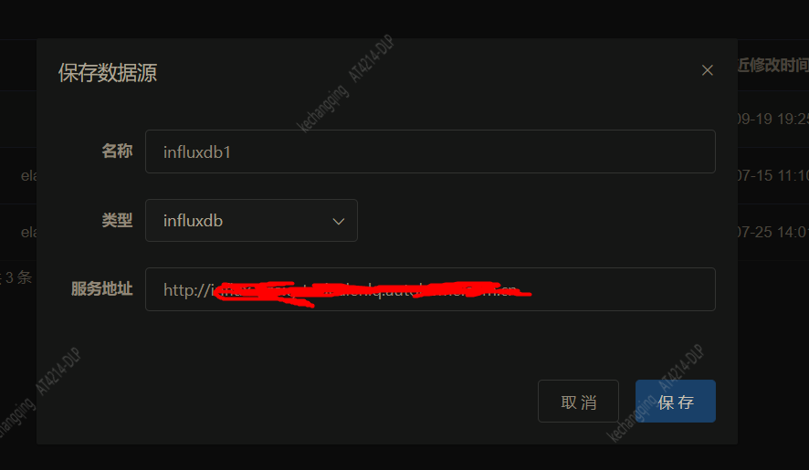
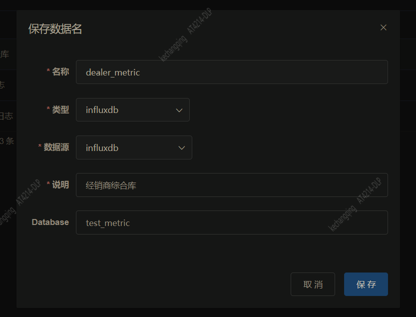
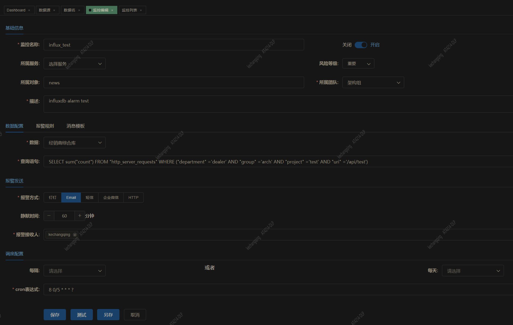

## InfluxDB数据监控指南

以流量日志某个接口pv监控为例子，说明创建一个InfluxDB数据监控的过程

### 1. 添加InfluxDB数据源

打开页面：数据管理->数据源，点击新增按钮，弹出窗口，填写字段并保存。



服务地址为influxdb http服务地址

### 2. 添加InfluxDB数据名

打开页面：数据管理->数据名，点击新增按钮，弹出窗口，填写字段并保存。



数据名在influxDB场景可以理解为influxDB数据库

### 3. 添加监控

打开页面：监控管理->监控编辑。填入信息并保存，保存前可以先进行测试。



查询语句如下，表示查询项目项目test的接口/api/test的pv

```
SELECT sum("count") FROM "http_server_requests" WHERE ("department" ='dealer' AND "group" ='arch' AND "project" ='test' AND "uri" ='/api/test')
```

> 注意不要在查询语句里添加时间查询条件，因为时间需要在报警规则里设置，由程序自动附加上去

#### 报警规则填写

报警规则和Elasticsearch数据监控无异

#### 报警模板

InfluxDB现在不会查询最近一个point数据出来，所以报警模板里的变量不包含measurement的字段，只有内置的字段。本例
设置的报警模板如下：

```
项目test接口/api/test最近${TIME_WINDOW}分钟内流量${NUMBER}条，超过报警阈值: ${THRESHOLD}
```