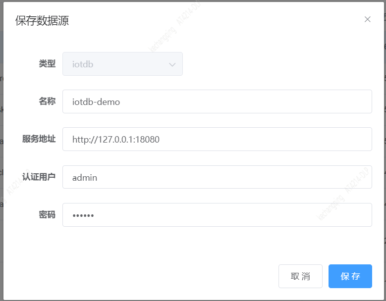
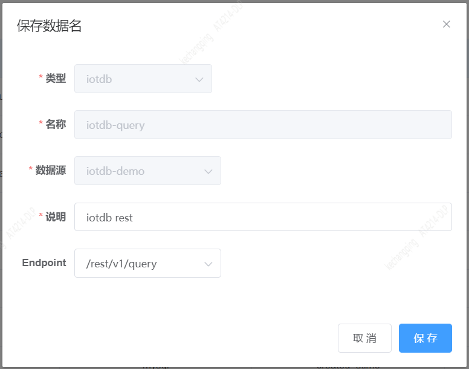
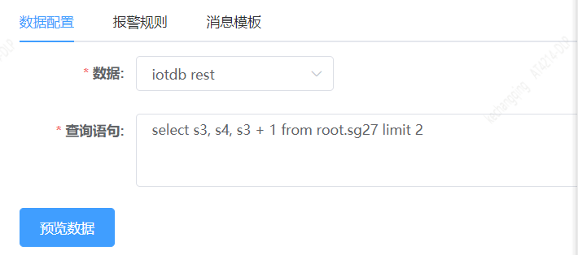
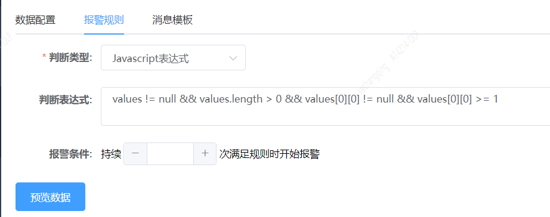

## iotdb数据监控指南

### 1. 添加iotdb数据源。如下图：



其中服务地址填写rest服务地址，如:

```
http://127.0.0.1:18080
```

### 2. 添加iotdb数据名。如下图



### 3. 编辑监控

#### 3.1 iotdb查询语法

数据选择上边创建的

查询语句举例如下：

```
select s3, s4, s3 + 1 from root.sg27 limit 2
```



关于iotdb查询语法，请参考[iotdb官方文档](https://github.com/apache/iotdb)。
举例仅用于展示查询语法和字段，具体自己根据需要修改。配置报警规则之后，可以预览数据。

#### 3.2 iotdb查询返回数据格式

返回数据举例：

```json
{
  "expressions": [
    "root.sg27.s3",
    "root.sg27.s4",
    "root.sg27.s3 + 1"
  ],
  "columnNames": null,
  "timestamps": [
    1635232143960,
    1635232153960
  ],
  "timestampsIso8601": [
    "2021-10-26T15:09:03.960+08:00",
    "2021-10-26T15:09:13.960+08:00"
  ],
  "values": [
    [
      11,
      null
    ],
    [
      false,
      true
    ],
    [
      12.0,
      null
    ]
  ]
}
```

### 4. 报警规则

报警规则可以根据返回数据，使用表达式判断，如：

```
values != null && values.length > 0 && values[0][0] != null && values[0][0] >= 1
```



### 5. 消息模板

消息模板可根据响应数据自己定制，下边举例供参考使用：

```
cpu利用率${values[0][0]}超过阈值1，请关注。
```

### 6. 测试监控

填完其他必填选项，可以先测试一下监控，看看效果。测试完保存即可。
