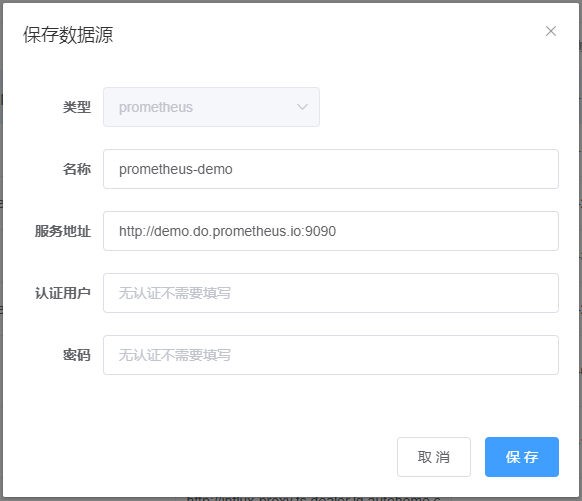
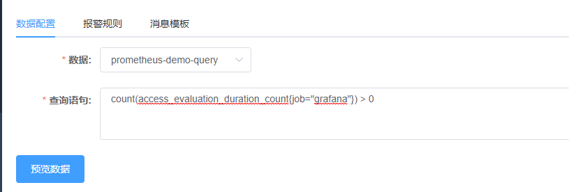
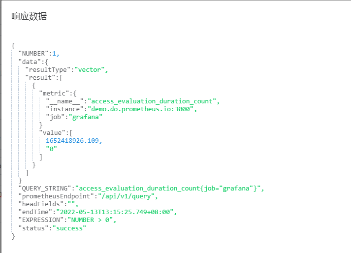

## Prometheus数据监控指南

### 1 添加Prometheus数据源



这里以prometheus官方 [Live demo](http://demo.do.prometheus.io:9090/) 举例；

### 2 添加数据名


目前已经支持 `/api/v1/query` 和 `/api/v1/query_range`

### 3 报警规则

选择上面创建的的数据名，填写查询语句，如下图：



查询语句举例：

```
access_evaluation_duration_count{job="grafana"} == 0
```

如果endpoint为 `/api/v1/query_range` 查询语句举例如下：

```json
{
  "query": "access_evaluation_duration_count",
  "start": "now - 1d",
  "end": "now",
  "step": "1h"
}
```

填报警规则，如下图


判断表达式举例:

```
NUMBER > 0
```

`NUMBER`取值为`prometheus`返回的符合查询条件的metric数量，相当于`data.result.length`；可以用于判断表达式；查询错误时`NUMBER`值为`-1`；

### 4 数据预览



```json
{
	"NUMBER": "1",
	"data": {
		"resultType": "vector",
		"result": [
			{
				"metric": {
					"__name__": "access_evaluation_duration_count",
					"instance": "demo.do.prometheus.io:3000",
					"job": "grafana"
				},
				"value": [
					1652351996.062,
					"0"
				]
			}
		]
	},
	"QUERY_STRING": "access_evaluation_duration_count",
	"prometheusEndpoint": "/api/v1/query",
	"headFields": "",
	"endTime": "2022-05-12T18:39:51.542+08:00",
	"EXPRESSION": "NUMBER > 0",
	"status": "success"
}
```

### 5 消息模板

可以根据响应数据自己定制消息模板，这里举例供参考使用

```
服务出现异常
name: ${data.result[0].metric.__name__}
instance: ${data.result[0].metric.instance}
job: ${data.result[0].metric.job}

详细请看： http://demo.do.prometheus.io:9090/graph?g0.expr=${QUERY_STRING}
```

消息举例：

```
服务出现异常
name: access_evaluation_duration_count
instance: demo.do.prometheus.io:3000
job: grafana

详细请看： http://demo.do.prometheus.io:9090/graph?g0.expr=access_evaluation_duration_count
```

### 6 测试并保存

填完其他必填选项，可以先测试一下监控，看看效果。测试完保存即可。
