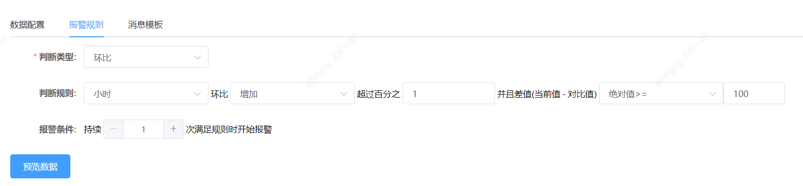

# 环比监控使用指南

## 同比，环比概念

在使用指标同比监控之前，先了解一下什么是同比，尤其是和环比概念的区别。

* 同比：自然时间段(分钟，小时，天等)内数值指标，比上一个时期的增减变化。
* 环比：相邻两个自然时间段内数值指标比较的增减变化

举个栗子：

```
站点A昨天的pv同比上周增长20%
```

```
站点A昨天的pv环比前天增长1%
```

## 环比监控报警规则

重点说环比报警规则如何配置，以及这些配置的含义。其他部分都和普通监控类似，不做更多讲解，不清楚的参考文档：
<a href="./es.md" target="_blank">Elasticsearch数据监控指南</a>

先看环比监控报警规则需要填写哪些配置：



假设离当前时间点最近的自然小时的数值为current, 前一自然小时的数值为reference。那么报警的触发条件是

```
(current - reference) * 100 / refercence >= 1 && |current - reference| >= 100
```

使用环比来比较相邻时间周期数据的变化；

## 报警消息模板

环比监控规则的报警消息模板默为：

```
指标XXX
<#list REFERENCE_LIST as item>
${item.referenceType}环比变化${item.percentage}%,超过阈值${PERCENTAGE_THRESHOLD}%, 当前值: ${CURRENT}, 对比值：${item.value};
</#list>
```

产生的钉钉机器人消息会像是这样：

```
[霜之哀伤监控平台][id:36]测试环比监控
@张三
消息类型: [问题] 60分钟内持续报警将不重复发送
[2022-06-07 18:32:58]
指标XXX
hour环比变化4.142%,超过阈值1%, 当前值: 11,919, 对比值：11,445;

详细请看: http://localhost:10054/goto/2231
```

你可以在这个模板的基础上做一些自己的修改。
