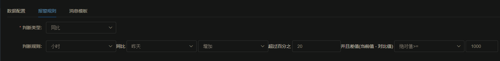

# 同比监控使用指南

## 同比，环比概念

在使用指标同比监控之前，先了解一下什么是同比，尤其是和环比概念的区别。

* 同比：自然时间段(分钟，小时，天等)内数值指标，比上一个时期的增减变化。
* 环比：相邻两个自然时间段内数值指标比较的增减变化

举个栗子：

```
站点A昨天的pv同比上周增长20%
```

```
站点A昨天的pv环比前天增长1%
```

## 同比监控报警规则

重点说同比报警规则如何配置，以及这些配置的含义。其他部分都和普通监控类似，不做更多讲解，不清楚的参考文档：
<a href="./es.md" target="_blank">Elasticsearch数据监控指南</a>  

先看同比监控报警规则需要填写哪些配置：



假设离当前时间点最近的自然小时的数值为current, 前一天相同自然小时的数值为reference。那么报警的触发条件是

```
(current - reference) * 100 / refercence >= 20 && |current - reference| >= 1000
```

使用同比主要的作用是规避指标的季节性，所以取相同季节来比较。比如雪糕的销售量，用环比比较9月和10月的销售量
并没有太大的意义，但是拿今年9月和去年9月比，就可以规避季节性干扰，反馈数值的本质含义。

## 报警消息模板

同比监控的报警消息模板默认为：

```
自然${PERIOD_UNIT_DESCRIPTION}
<#list REFERENCE_LIST as item>
指标同比${item.description}变化${item.percentage}%,超过阈值${PERCENTAGE_THRESHOLD}%, 当前值: ${CURRENT}, 对比值：${item.value};
</#list>
```

产生的钉钉机器人消息会像是这样：

```
[霜之哀伤监控平台][id:36]测试同比监控
@张三
消息类型: [问题] 60分钟内持续报警将不重复发送
[2020-08-29 18:32:58]
自然小时
指标同比昨天变化30%,超过阈值29%, 当前值: 4,392.02, 对比值：2,413.131;


详细请看: http://shotren.link/
```

你可以在这个模板的基础上做一些自己的修改。