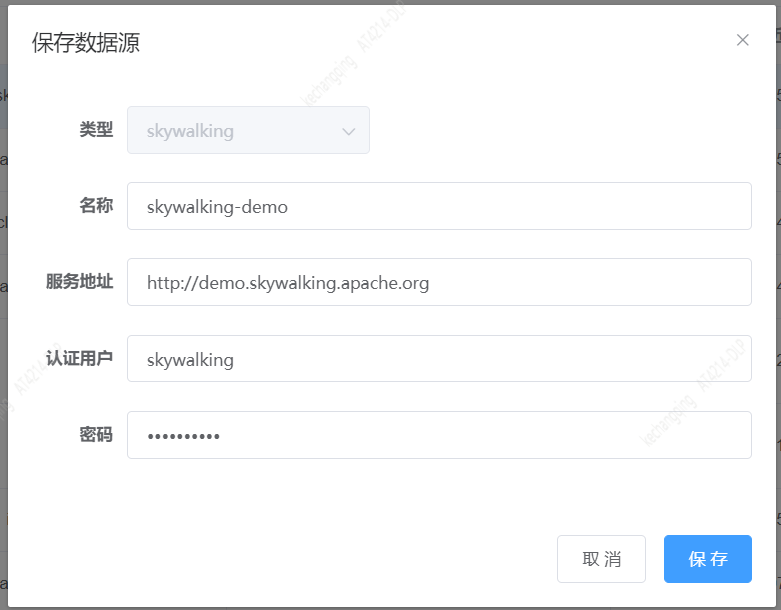
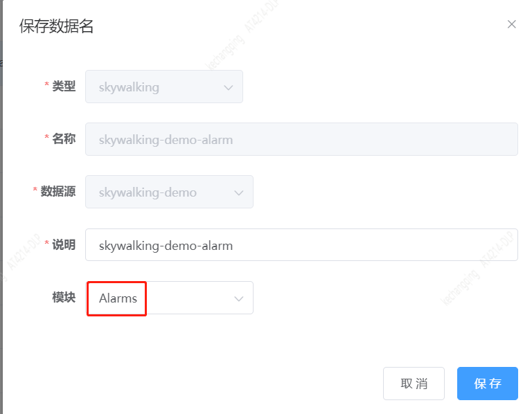
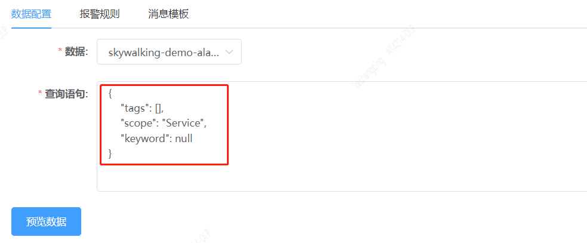

## Skywalking-Alarms数据监控指南

### 1. 添加Skywalking数据源。如下图：



这里以SkyWalking官方的 [Live demo](http://demo.skywalking.apache.org/) 服务为例子。

### 2. 添加skywalking-alarm数据名。如下图



模块选择Alarms

### 3. 编辑监控

#### 3.1 skywalking-Alarm查询语法

skywalking-alarm查询语句举例：

```json
{
    "tags": [
      {
        "key": "k",
        "value": "v"
      }
    ],
    "scope": "Service",
    "keyword": "rule"
}
```

举例仅用于展示查询语法和字段，具体自己根据需要修改。配置报警规则之后，可以预览数据。



#### 3.2 Skywalking返回Alarm数据格式

```json
{
  "key": "YWdlbnQ6OmFwcA==.1",
  "message": "Alarm caused by Rule service_resp_time_rule",
  "startTime": 1652154203379,
  "scope": "Service",
  "tags": [],
  "events": [
    {
      "uuid": "1558cdd9-bf1d-42e2-8e2e-9c12f873d51e",
      "source": {
        "service": "agent::app",
        "serviceInstance": "",
        "endpoint": ""
      },
      "name": "Alarm",
      "type": "Error",
      "message": "Alarm caused by Rule service_resp_time_rule",
      "parameters": null,
      "startTime": 1652153903380,
      "endTime": 1652154203380
    },
    {
      "uuid": "446d2ccc-0d4c-4810-b6fe-11d90179106c",
      "source": {
        "service": "agent::app",
        "serviceInstance": "",
        "endpoint": ""
      },
      "name": "Alarm",
      "type": "Error",
      "message": "Alarm caused by Rule service_resp_time_rule",
      "parameters": null,
      "startTime": 1652153543380,
      "endTime": 1652153843380
    }
  ]
}
```

### 3.3 消息模板

消息模板可根据响应数据自己定制，下边举例供参考使用：

```
Skywalking最近${TIME_WINDOW}分钟内有报警${NUMBER}条。最近一条报警信息:
message: ${message}

详细请看： http://demo.skywalking.apache.org/alarm
```

对应报警消息:

```
Skywalking最近50分钟内有报警20条。最近一条报警信息:
message: Alarm caused by Rule service_resp_time_rule

详细请看： http://demo.skywalking.apache.org/alarm
```

### 4 测试监控

填完其他必填选项，可以先测试一下监控，看看效果。测试完保存即可。
