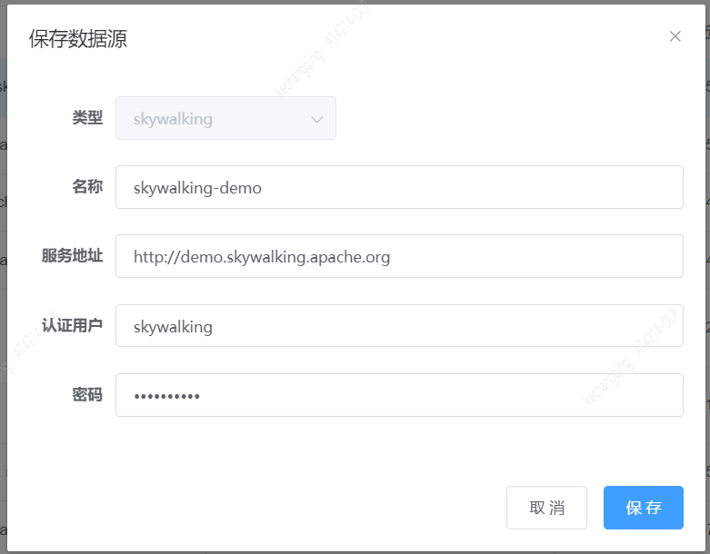

## Skywalking-Logging数据监控指南

### 1. 添加Skywalking数据源。如下图：



### 2. 添加skywalking-logging数据名。如下图


模块选择Logging

### 3. 编辑监控

#### 3.1 skywalking日志查询语法

数据选择上边创建的

查询语句举例如下：

```json
{
    "serviceId": "YWdlbnQ6OnNvbmdz.1",
    "tags": [{ "key":  "level", "value": "INFO"}],
    "keywordsOfContent": [],
    "excludingKeywordsOfContent": []
}
```

举例仅用于展示查询语法和字段，具体自己根据需要修改。配置报警规则之后，可以预览数据。

#### 3.2 Skywalking返回日志数据格式

```json
{
    "serviceName": "agent::songs",
    "serviceId": "YWdlbnQ6OnNvbmdz.1",
    "serviceInstanceName": "6cb4d46dbed047d6a083475f3ee7914e@10.76.0.154",
    "serviceInstanceId": "YWdlbnQ6OnNvbmdz.1_NmNiNGQ0NmRiZWQwNDdkNmEwODM0NzVmM2VlNzkxNGVAMTAuNzYuMC4xNTQ=",
    "endpointName": null,
    "endpointId": null,
    "traceId": "bcaadfe475f141818cb3fc777716caf8.1.16521108288670001",
    "timestamp": 1652110828871,
    "contentType": "TEXT",
    "content": "2022-05-09 15:40:28.871 [TID:bcaadfe475f141818cb3fc777716caf8.1.16521108288670001] [main] INFO  com.zaxxer.hikari.HikariDataSource -HikariPool-1 - Starting...\n",
    "tags": [
        {
            "key": "level",
            "value": "INFO"
        },
        {
            "key": "logger",
            "value": "com.zaxxer.hikari.HikariDataSource"
        },
        {
            "key": "thread",
            "value": "main"
        }
    ]
}
```

### 4. 消息模板

消息模板可根据响应数据自己定制，下边举例供参考使用：

```
${serviceName}最近${TIME_WINDOW}分钟内有错误日志${NUMBER}条。最近一条日志信息:
traceId: ${traceId}
serviceInstanceName: ${serviceInstanceName}
content: ${content}

详细请看： http://demo.skywalking.apache.org/dashboard/GENERAL/Service/${serviceId}/General-Service
```

### 4 测试监控

填完其他必填选项，可以先测试一下监控，看看效果。测试完保存即可。
