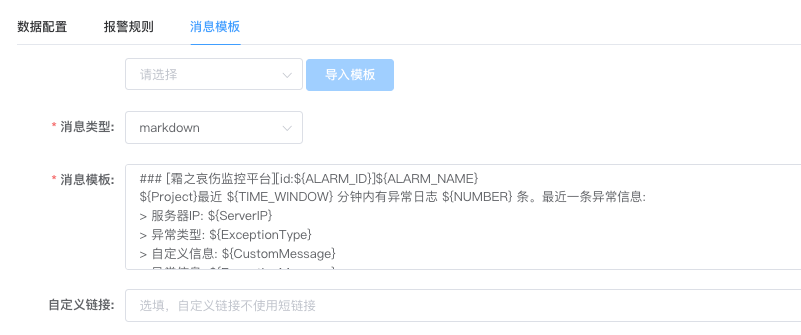
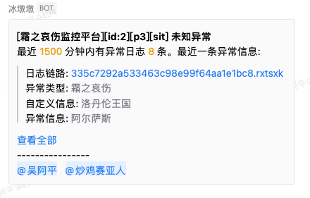

## markdown消息模板配置

在0.6版本后，消息模版在支持 [freemarker语法](./doc/wiki/template.md) 的基础上，钉钉机器人、企业微信机器人渠道实现了markdown格式

在消息模版配置tab页面新增消息类型（text、markdown）的选择，默认是text，如图



## 由于各个渠道的接口不同，这里不同渠道分别描述

### 企业微信机器人
企业微信webhook使用markdown类型时，消息完全开放自定义，不会再添加固定title，可以在内容里自行添加title。企业微信webhook目前支持的markdown语法是如下的子集：
```
标题 （支持1至6级标题，注意#与文字中间要有空格）
# 标题一
## 标题二
### 标题三
#### 标题四
##### 标题五
###### 标题六

加粗
**bold**

链接
[这是一个链接](http://work.weixin.qq.com/api/doc)

行内代码段（暂不支持跨行）
`code`

引用
> 引用文字

字体颜色(只支持3种内置颜色)
<font color="info">绿色</font>
<font color="comment">灰色</font>
<font color="warning">橙红色</font>
```


企业微信机器人报警效果图如下



### 钉钉机器人
钉钉机器人webhook使用markdown类型时，由于接口title为必传字段，所以会默认固定title，规则为：
> [${frostmourne_message_title}][id:${ALARM_ID}]${ALARM_NAME}

目前钉钉机器人webhook目前只支持Markdown语法的子集，支持的元素如下

```
标题
# 一级标题
## 二级标题
### 三级标题
#### 四级标题
##### 五级标题
###### 六级标题
 
引用
> A man who stands for nothing will fall for anything.
 
文字加粗、斜体
**bold**
*italic*
 
链接
[this is a link](https://www.dingtalk.com/)
 
图片

 
无序列表
- item1
- item2
 
有序列表
1. item1
2. item2
```
